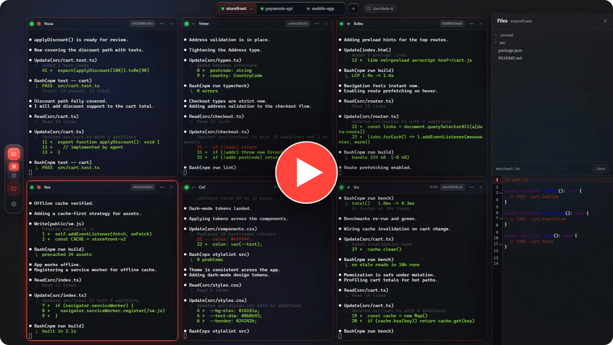

<p align="center">
  <picture>
    <source media="(prefers-color-scheme: dark)" srcset="build/logo-mark-white.png">
    
  </picture>
</p>

<h1 align="center">Monad</h1>

<p align="center">
  <b>Run every AI coding agent at once.</b><br>
  A desktop canvas of live terminals — Claude Code, Codex, Gemini and more working in
  parallel, each sealed in its own git worktree, with diff &amp; merge built in.
</p>

<p align="center">
  <a href="https://serhii-leniv.github.io/Monad/"></a>
  <a href="https://github.com/Serhii-Leniv/Monad/releases/latest"></a>
  <a href="https://github.com/Serhii-Leniv/Monad/actions/workflows/ci.yml"></a>
  <a href="https://github.com/Serhii-Leniv/Monad/stargazers"></a>
  
  
</p>

<p align="center">
  <a href="https://github.com/Serhii-Leniv/Monad/blob/main/assets/demo.mp4">
    
  </a>
  <br>
  <sub><a href="https://github.com/Serhii-Leniv/Monad/blob/main/assets/demo.mp4">▶ Watch the 45-second demo</a></sub>
</p>

---

**[Download](#download)** · **[Quick start](#quick-start)** · **[How it compares](#how-it-compares)** ·
**[FAQ](#faq)** · **[Build from source](#build-from-source)** · **[Contributing](#contributing)**

---

## Why Monad

One screen. A whole team of agents. Monad turns your desktop into a control room for
parallel AI coding — start five agents, keep them from stepping on each other, and merge
the one that got it right, all without leaving the app.

- ⚡ **Parallel by design** — a canvas of live terminal cards with automatic tiling. Start a swarm and watch them all at once, no tab-juggling.
- 🧬 **True isolation** — every agent gets its own branch and git worktree, so parallel edits never clobber each other or your working tree.
- 🔀 **Diff &amp; merge in-app** — review an agent's changes against your base branch and land them, or discard the branch, without breaking focus.
- 🔔 **Knows who needs you** — live per-agent status (working · idle · waiting) plus a desktop ping when a backgrounded agent finishes or gets stuck.
- 💾 **Picks up where you left off** — close the app and reopen later; each terminal restores in place and relaunches its agent.
- 🎨 **Yours to theme** — a liquid-glass interface with your own accent colour, wallpaper, and adjustable terminal transparency.

## Bring your own agents

Monad orchestrates the agent CLIs you already run — **Claude Code, Codex, Gemini, Cursor**,
or any terminal tool — and spawns them on your machine with your own keys. No middleman, no
markup, no extra subscription, and **no inference cost**: the intelligence is whatever you've
already installed.

## Private by design

Monad runs entirely on your machine, against your repo. Your code never leaves your computer,
agents use your own credentials, and there's no telemetry and no background service — just the
app and the tools you choose to run.

## How it compares

If you're already running agents in parallel, you're probably doing one of these:

| Instead of… | Monad gives you |
| --- | --- |
| **Tiled terminal panes** (tmux, Windows Terminal) | The same tiling, plus per-agent worktrees, status, and diff/merge — no scripting |
| **Manual `git worktree` juggling** | Worktree create/teardown per agent, handled automatically |
| **One agent at a time in your IDE** | Five agents on the same task, then merge the one that got it right |
| **A cloud agent platform** | Local execution, your own CLIs and keys, no inference bill, no code leaving your machine |

Monad isn't another agent — it's the surface you run the agents you already pay for on.

## Download

Get the latest build for your platform:

| Platform | Download |
| --- | --- |
| **macOS** (Apple Silicon) | [Monad&#8209;macOS&#8209;arm64.dmg](https://github.com/Serhii-Leniv/Monad/releases/latest/download/Monad-macOS-arm64.dmg) |
| **Windows** (x64) | [Monad&#8209;Windows&#8209;Setup.exe](https://github.com/Serhii-Leniv/Monad/releases/latest/download/Monad-Windows-Setup.exe) |

Or head to **[the download page](https://serhii-leniv.github.io/Monad/)** for install notes and
older versions. Monad checks for new releases on launch and points you here when one's ready.

## Quick start

1. **Install an agent CLI** you'd like to run — [`claude`](https://docs.claude.com/en/docs/claude-code/overview), `codex`, `gemini`, or `cursor-agent` — and make sure it's on your `PATH`.
2. **Open a project** — point Monad at any folder. A git repo unlocks per-agent worktree isolation.
3. **Add agents** from the toolbar. Each card is a real terminal; up to nine tile automatically.
4. **Review &amp; merge** — open a card's **Diff** tab to read its changes, then **Merge** into your base branch or **Discard**.

## Build from source

Prefer to run it yourself? You'll need **Node.js + npm** and **git**.

```bash
npm install
npm run dev          # dev with hot reload
# or a production-like run:
npm run build
npm run preview
```

No Rust/C++ toolchain required — Monad is an Electron app and `node-pty` installs a prebuilt
binary (see `.npmrc`, which pins the Electron ABI).

## Under the hood

- **Terminals** — xterm.js ↔ `node-pty` (prebuilt) over IPC, with output batched before it crosses the boundary.
- **Isolation** — `git worktree add` per agent (branch `canvas/<id>`), kept in a sibling `.monad-worktrees/` folder; agents are cwd-pinned after spawn so a shell profile can't move them out of their worktree.
- **Persistence** — the whole tab set lives in `workspaces.json` in the app's user-data folder, written atomically.
- **Updates** — on launch the app checks the [release feed](https://github.com/Serhii-Leniv/Monad/releases) and shows an in-app notice when a newer version is out.

Full details — process split, security posture, and the two test layers — are in
**[docs/ARCHITECTURE.md](docs/ARCHITECTURE.md)**.

## FAQ

<details>
<summary><b>Does Monad cost anything to run?</b></summary>

No. Monad is MIT-licensed and free, and it has no inference cost of its own — it drives the agent
CLIs already installed on your machine, using your existing credentials and plans.
</details>

<details>
<summary><b>Do I need a git repository?</b></summary>

No, but it's recommended. Monad opens any folder; a git repo is what unlocks per-agent worktree
isolation, diff, and merge. Without git you still get the parallel terminal canvas.
</details>

<details>
<summary><b>macOS says the app is "damaged and can't be opened."</b></summary>

Builds aren't yet signed with a paid Apple Developer certificate, so Gatekeeper quarantines them.
Remove the quarantine flag once after installing:

```bash
xattr -dr com.apple.quarantine /Applications/Monad.app
```

Windows shows a comparable one-time SmartScreen prompt (**More info → Run anyway**). Proper signing
and notarization are on the roadmap.
</details>

<details>
<summary><b>How many agents can run at once?</b></summary>

Up to nine tile automatically on the canvas. Each is a real PTY, so the practical limit is your
machine's CPU and memory.
</details>

<details>
<summary><b>Where does Monad store my data?</b></summary>

Workspace and layout state lives in `workspaces.json` in the app's user-data folder. Agent branches
live in a sibling `.monad-worktrees/` directory next to your repo. Nothing is sent anywhere — there's
no account, no telemetry, and no background service.
</details>

## Contributing

Issues and pull requests are welcome — see **[CONTRIBUTING.md](CONTRIBUTING.md)** for how to get
set up, which checks to run, and PR guidelines. For larger changes, open an issue first so we can
agree on the approach.

Monad is in active development and every report helps —
[open an issue](https://github.com/Serhii-Leniv/Monad/issues/new/choose) with bugs or feature
requests. Found a security problem? Please report it privately via
[SECURITY.md](SECURITY.md).

## Docs

- [Architecture](docs/ARCHITECTURE.md) — how the main/preload/renderer split works, and the tests
- [Changelog](docs/CHANGELOG.md) — what changed in each release
- [Releasing](docs/RELEASING.md) — cutting a build and publishing installers

## License

[MIT](LICENSE) © Serhii Leniv
