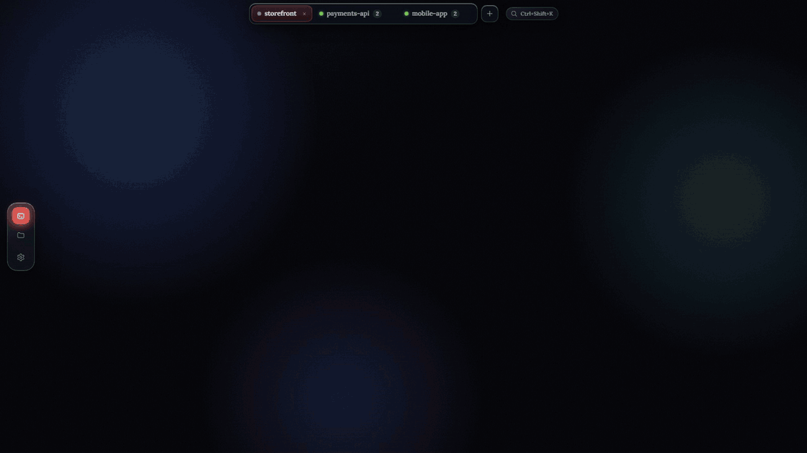

<p align="center">
  <picture>
    <source media="(prefers-color-scheme: dark)" srcset="build/mark-knockout-light-1024.png">
    
  </picture>
</p>

<h1 align="center">Monad</h1>

<p align="center">
  <b>Run a whole team of coding agents at once.</b><br>
  The desktop space for parallel agentic coding — start five, keep them out of each
  other's way, ship the one that nailed it.
</p>

<p align="center">
  <a href="https://serhii-leniv.github.io/Monad/"></a>
  <a href="https://github.com/Serhii-Leniv/Monad/releases/latest"></a>
  <a href="https://github.com/Serhii-Leniv/Monad/actions/workflows/ci.yml"></a>
  <a href="https://github.com/Serhii-Leniv/Monad/stargazers"></a>
  
  
</p>

<p align="center">
  
  <br>
  <sub><a href="https://github.com/Serhii-Leniv/Monad/blob/main/assets/demo.mp4">▶ Watch the full demo</a></sub>
</p>

---

**[Download](#download)** · **[Quick start](#quick-start)** · **[FAQ](docs/FAQ.md)** ·
**[Docs](#docs)**

---

## Why Monad

You already know the move: throw the same task at three agents, take the best answer. What
you don't have is a place to *do* it. Monad is that place.

## Bring your own agents

Monad drives the agent CLIs you already run — **Claude Code, Codex, Gemini, Cursor**, or any
terminal tool — spawned on your machine with your own keys. No middleman, no markup, no extra
subscription, and **no inference cost**: the intelligence is whatever you've already installed.

Which also means nothing leaves your computer. No account, no telemetry, no background
service — just the app and the tools you point it at.

## Download

| Platform | Download |
| --- | --- |
| **macOS** (Apple Silicon) | [Monad&#8209;macOS&#8209;arm64.dmg](https://github.com/Serhii-Leniv/Monad/releases/latest/download/Monad-macOS-arm64.dmg) |
| **Windows** (x64) | [Monad&#8209;Windows&#8209;Setup.exe](https://github.com/Serhii-Leniv/Monad/releases/latest/download/Monad-Windows-Setup.exe) |

> [!IMPORTANT]
> **macOS needs one extra command on first launch.** Monad isn't signed with a paid Apple
> Developer certificate yet, so macOS quarantines it and claims the app is *"damaged."* It
> isn't. After dragging Monad to Applications, clear the flag once:
>
> ```bash
> xattr -dr com.apple.quarantine /Applications/Monad.app
> ```
>
> Windows shows a comparable one-time SmartScreen prompt (**More info → Run anyway**).
> Signing and notarization are on the roadmap.

Older versions and install notes live on **[the download page](https://serhii-leniv.github.io/Monad/)**.
Monad checks for updates on launch and tells you when one's ready.

## Quick start

1. **Install an agent CLI** — [`claude`](https://docs.claude.com/en/docs/claude-code/overview),
   `codex`, `gemini`, or `cursor-agent` — and make sure it's on your `PATH`.
2. **Open a project.** Point Monad at any folder; a git repo is what unlocks per-agent isolation.
3. **Add agents** from the toolbar. Each card is a real terminal; up to nine tile automatically.
4. **Review & merge.** Open a card's **Diff** tab, then **Merge** into your base branch — or
   **Discard** and let the next agent take it.

## Docs

- **[FAQ](docs/FAQ.md)** — cost, git requirements, agent limits, where your data lives, how
  Monad compares to tmux and cloud agent platforms
- **[Architecture](docs/ARCHITECTURE.md)** — process split, isolation model, security posture, tests
- **[Contributing](CONTRIBUTING.md)** — building from source, the checks to run, PR guidelines
- **[Changelog](docs/CHANGELOG.md)** — what changed in each release

Monad is in active development and every report helps —
[open an issue](https://github.com/Serhii-Leniv/Monad/issues/new/choose) with bugs or feature
requests. Found a security problem? Report it privately via [SECURITY.md](SECURITY.md).

## License

[MIT](LICENSE) © Serhii Leniv
